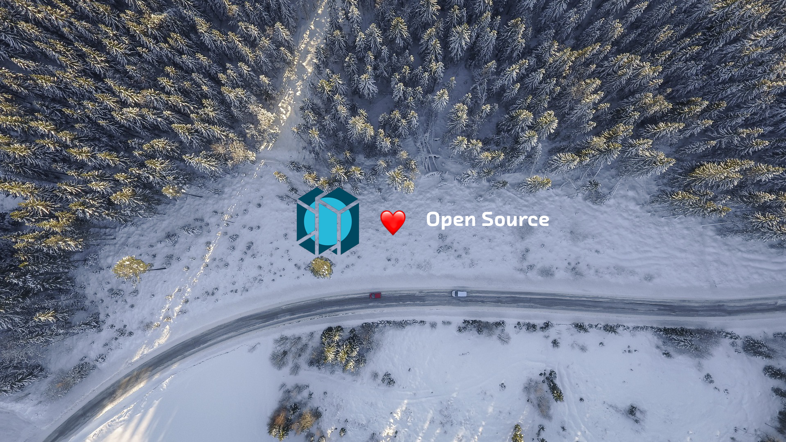

# motius.github.io

## Mission Statement

Motius is committed to open source. We want to push the open source community regardless of whether Motius directly benefits from it - we all use OSS code, so we should give back! Open source software and hardware is an integral part of your daily business, whether you realize it or not. It's in the cloud, in your phone, in your car and in your homes. All of it provided by individuals and organizations that care and want to lend out their expertise to our community free of charge.

Enterprises of all sizes not only use open source software but publish and contribute to such projects daily. There are many ways to contribute, so scroll down to learn more.

## What is this page about?

The idea is to curate and promote the open source work of our whole team - ELU projects, client projects but also _private_ repositories from our team. If a team member is active in the open source community, he or she should get credit for it! We are proud of this work and want to share it with you.

## What is ELU?

Every 6 months, we ask our Motees about what they would like to learn. The only condition is that it should be a tech or approach that isn’t older than a year.

Then we reserve a whole Friday every two weeks to learn those things in teams. This lasts for 6 months, The application here is not important, it is about the tech. We then go to mountains and spend a weekend finalizing our products.

We come back and start over.

To learn more about our culture click [here](https://www.motius.de/en/talents-culture/).

## Our current repositories

- [django-rest-recaptcha](https://github.com/motius/django-rest-recaptcha): Our star lead so far! _Django rest recaptcha field for easy integration of google recaptcha with django-rest-framework._
- [dockerfiles](https://github.com/motius/dockerfiles): Dockerfiles from our daily work at Motius. Continued work on nextcloud, nginx-php but also bareos, sonarqube, polr, ...
- [react-native-telephony-apis](https://github.com/motius/react-native-telephony-apis): One that should have been on npm a while ago.. we'll get there! _An interface to the CoreTelephony (Cocoa) framework and TelephonyManager (Android) for React Native._
- [nginx-docker-env](https://github.com/motius/nginx-docker-env): _It's a container that packages an nginx server with bindings for running Lua scripts and the Lua DKJSON library. When you have a project where you need to serve some application that needs access to the environment variables of the container then you can use this container to quickly do that._
- ... to be continued!

## Some cool private projects from our team

So, here it goes in no particular order (you are all awesome):

- [Webexcel](https://github.com/michaelneu/webxcel): one of the crazier ones! _Webxcel creates a full-fledged RESTful web backend from your Microsoft Excel workbooks. It is written in 100% plain Visual Basic macros and comes with a lot of handy tools to help you build the next big thing._
- [test-genie](https://github.com/tech4242/test-genie): group effort from an ELU team. _A small Go server to help you unit test your frontend by fetching "real" mock data from your live server. The whole point is to let you unit test your frontend with up-to-date data instead of static json files in your frontend code._
- [hackatum-windowsIotCamera](https://github.com/Hustenbonbon/hackatum-windowsIotCamera): old but gold from HackaTUM 2016. _Windows IoT background app for raspberry pi. It uses an ultrasonic sensor, a DHT11 for humidity and temperature and a webcam to take pictures_
- [small-data-classification](https://github.com/aprams/small-data-classification): can't go anywhere without TF nowadays, so here is some deep learning. _This project allows binary image classification for small datasets, based on retraining the final layer of a MobileNetV2._
- [tippi-link](https://github.com/furqan-shakoor/tippi-link) together with [sharfoo](https://github.com/furqan-shakoor/sharfoo): Sharfoo is a MacOS menu bar app that tracks the status of your TP-Link router, which uses tippi-link - a scraper for the TP-LINK router admin portal.
- The next one should be _yours_? Write to us in the team channel on Slack!
